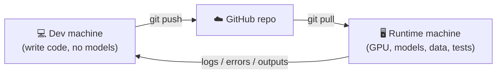
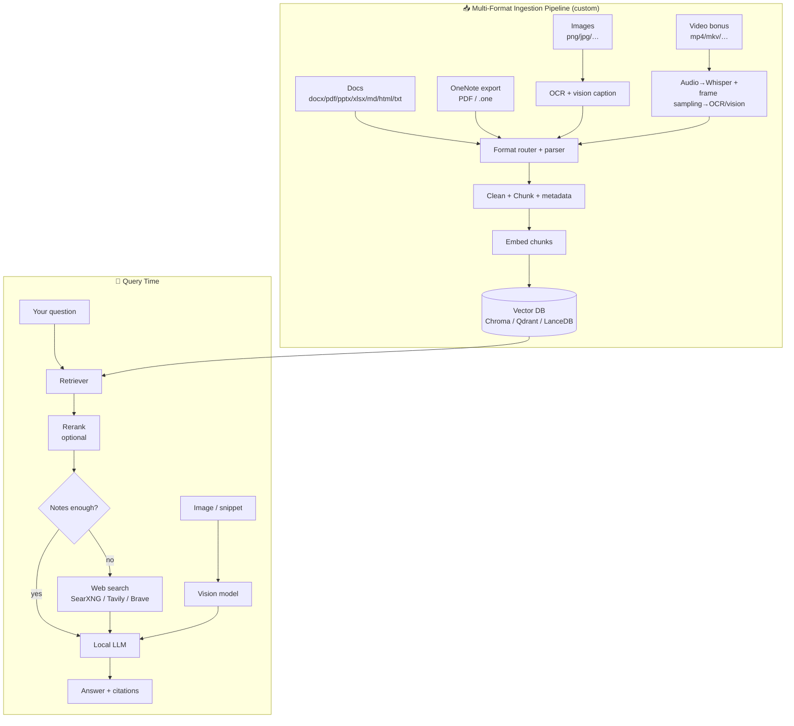

# PersonalAI — Local Notes-Aware AI Assistant

A private, evolving AI assistant built around your own knowledge (OneNote plus many other
document types and images, with video as a bonus), with web search, vision/OCR, and (later)
voice. Code is written on a code-only machine and synced via GitHub; all models, data, and
testing run on a separate GPU machine. Optimized for Windows networking & Windows debugging
workflows, but general-purpose.

> **Status:** Planning
> **Owner:** You
> **Last updated:** 2026-06-30

---

## 1. Goal & Guiding Principles

**Goal:** A local assistant that answers from *your* notes first, falls back to the web
when notes are insufficient, can read screenshots/snippets (OCR + visual understanding),
and grows as you add new notes — all running on your own hardware for privacy.

**Principles:**

1. **Notes-first, web-second.** Always ground answers in your notes; only reach out to
   the internet when retrieval confidence is low or the user asks for current info.
2. **Evolving, not frozen.** Adding notes must be a *data* operation (re-index), never a
   model retraining. This is why we use **RAG**, not fine-tuning, for knowledge.
3. **Citations always.** Every answer shows which note/page/web source it came from, so
   you can trust and verify.
4. **Local & private by default.** Models, notes, and the vector index stay on your
   machine. The internet is opt-in per query.
5. **Incremental.** Ship a working text assistant first; add vision, then voice.
6. **Code here, run there.** This machine writes code only; all models and testing run on a
   separate GPU machine. Code must be portable, config-driven, and synced via Git.
7. **Reuse over rebuild.** Prefer mature, self-hostable tools where they help — as long as
   data stays local.

### 1.1 Development & Deployment Workflow (Two-Device Setup)

This project is developed on a **code-only machine** and executed/tested on a separate
**runtime machine** (Ryzen 7 7800X3D + RX 7900 XT). The loop:



**Implications for how we build:**

- **No hardcoded paths or machine assumptions.** All paths, model names, endpoints, and
  toggles live in config (`config.yaml` / `.env`), not in code.
- **Reproducible setup.** Pin dependencies (`requirements.txt` / `pyproject.toml`) and
  document one-command setup so the runtime machine matches exactly.
- **Data never leaves the runtime machine.** Notes, the vector index, and large media stay
  on the GPU box and are **git-ignored**. Only code + config templates are synced.
- **Rich logging & a CLI.** Every stage (ingest, query, eval) logs clearly and runs
  headless, so you can paste failures/outputs back here for debugging.
- **Smoke tests + sample data.** A tiny committed sample verifies the pipeline on the
  runtime machine before pointing it at your real corpus.

**Suggested repo layout:**

```text
personal-ai/
├─ README.md                 # setup + run instructions for the runtime machine
├─ config.example.yaml       # template; real config is git-ignored
├─ requirements.txt
├─ .gitignore                # excludes data/, models/, index/, .env
├─ src/
│  ├─ ingest/                # multi-format loaders (docs, images, video)
│  │  ├─ loaders.py
│  │  ├─ ocr.py
│  │  ├─ transcribe.py       # video/audio → text (bonus)
│  │  └─ pipeline.py         # parse → chunk → embed → store
│  ├─ rag/                   # retrieval, reranking, prompt assembly
│  ├─ web/                   # local-first web search adapter
│  ├─ app/                   # API / UI glue
│  └─ config.py
├─ scripts/
│  ├─ ingest.py              # CLI: ingest a folder/file
│  ├─ query.py               # CLI: ask a question
│  └─ eval.py                # CLI: run the eval set
├─ tests/
└─ data/                     # git-ignored: your real notes & media live here
```

---

## 2. The Core Decision: RAG vs. Fine-Tuning

| Aspect | RAG (chosen) | Fine-Tuning |
|---|---|---|
| Add new notes | Instant — just re-index the new file | Re-train; slow & costly |
| Forgetting/old data | Never; index is the source of truth | Catastrophic forgetting risk |
| Citations | Native (you know which chunk was used) | None — knowledge is opaque |
| Hardware cost | Low (embeddings are cheap) | High (GPU hours, VRAM pressure) |
| Best for | **Facts & knowledge that change** | Tone, format, style, narrow skills |

**Decision:** Use **RAG for all knowledge.** Optionally, *much later*, do a light
fine-tune (LoRA) only to teach the model your preferred answer **style/format** — never
for facts. For now: skip fine-tuning entirely.

---

## 3. Hardware Reality Check (Your Rig)

- **CPU:** Ryzen 7 7800X3D — excellent for embeddings, OCR, orchestration, CPU fallback.
- **GPU:** Radeon RX 7900 XT, **20 GB VRAM** (RDNA3 / `gfx1100`).
- **Verdict:** More than enough. 20 GB VRAM comfortably runs a **14B** model fully on GPU,
  or a **32B** model quantized (Q4) at usable speed, plus a vision model.

### The one gotcha: AMD on Windows

AMD's GPU compute (ROCm) is most mature on **Linux**. You have three viable paths:

| Path | Effort | Performance | Recommendation |
|---|---|---|---|
| **A. Windows + LM Studio (Vulkan)** | Lowest | Good | **Start here** — easiest, AMD-friendly |
| **B. Windows + Ollama (ROCm/Vulkan)** | Low | Good | Great for scripting/automation |
| **C. Dual-boot or WSL2 + Linux ROCm** | Higher | Best | Do later if you want max speed |

> Recommendation: begin on **Windows with Ollama** (scriptable, huge ecosystem) and keep
> LM Studio installed as a GUI fallback. Move to Linux/ROCm only if you crave more speed.

---

## 4. Recommended Model Stack

All models run locally. Sizes assume your 20 GB VRAM.

| Role | Model (suggested) | Why |
|---|---|---|
| **Primary chat LLM** | Qwen2.5 14B Instruct (Q5/Q6) — or Llama 3.1 8B for speed | Strong reasoning, fits fully on GPU, fast |
| **Heavyweight option** | Qwen2.5 32B Instruct (Q4) | Smarter answers when you can accept slower tokens |
| **Vision / OCR understanding** | Qwen2.5-VL 7B (or LLaVA 1.6) | Understands screenshots, diagrams, code shots |
| **Embeddings (RAG)** | `nomic-embed-text` or `bge-large-en` / `mxbai-embed-large` | High-quality retrieval, cheap to run |
| **Reranker (optional, boosts quality)** | `bge-reranker-v2-m3` | Re-orders retrieved chunks for relevance |

> You can swap models freely later — that's the benefit of RAG + a model runtime.

---

## 5. Architecture Overview



**Two flows:**
- **Ingestion** (offline, run when you add files): route by format → parse / OCR /
  transcribe → chunk → embed → store. Handles docs, images, and (bonus) video.
- **Query** (live): retrieve from your data → optionally web → LLM → cited answer.

---

## 6. Technology Choices (with rationale)

| Layer | Recommended | Alternatives | Notes |
|---|---|---|---|
| **Model runtime** | Ollama | LM Studio, llama.cpp | Ollama = scriptable API + model mgmt |
| **All-in-one UI/RAG** | **Open WebUI** | AnythingLLM, LibreChat | Gives RAG + web + vision + voice out of box |
| **Vector DB** | ChromaDB (simple) | Qdrant (scales), LanceDB | Start simple, migrate if needed |
| **Orchestration** | LlamaIndex | LangChain, custom | LlamaIndex is RAG-focused, less boilerplate |
| **Document parsing (multi-format)** | `unstructured` + PyMuPDF (`fitz`) | `docling`, `pandoc`, `python-docx`, `python-pptx` | One router for docx/pdf/pptx/xlsx/md/html/txt |
| **OCR (images & scans)** | Tesseract (`pytesseract`) | PaddleOCR, vision LLM | Vision LLM for complex/handwritten shots |
| **Video → text (bonus)** | `faster-whisper` (audio) + frame sampling | `ffmpeg` + vision model | Transcribe speech + OCR on-screen text |
| **Web search (local-first)** | **SearXNG (self-hosted)** | DuckDuckGo, Brave/Tavily API | SearXNG keeps queries on your box; APIs send the query out |
| **Language** | Python 3.11+ | — | Best AI/ML ecosystem |

> **Big shortcut:** **Open WebUI + Ollama** (both self-hostable, data stays local) already
> provide chat, document RAG, web search, vision, and even voice (TTS/STT). Your *custom*
> work is mainly the **multi-format ingestion pipeline** that turns messy docs, images, and
> (bonus) videos into clean, chunked, embedded text — plus pointing web search at a local
> SearXNG so queries don't leak. Using existing services is fine **as long as each is
> configured local-only** (the one inherent exception: a web search necessarily sends the
> search query to the internet).

---

## 7. Phased Build Plan

Each phase produces something usable. Times assume **part-time effort (evenings/weekends)**.
Full-time would be roughly 3–4× faster.

### Phase 0 — Environment & First Tokens
*Goal: a local model answering questions in a browser.*
- [ ] Update AMD Adrenalin drivers.
- [ ] Install Ollama (Windows) and pull `qwen2.5:14b` (or `llama3.1:8b`).
- [ ] Verify GPU usage (`ollama run`, check VRAM in Task Manager).
- [ ] Install Open WebUI (Docker or pip) and connect to Ollama.
- **Deliverable:** Chatting with a local LLM, fully offline.
- **Estimate:** **2–4 evenings.**

### Phase 1 — Manual RAG Proof of Concept
*Goal: ask questions over a handful of notes.*
- [ ] Pull an embedding model (`nomic-embed-text`).
- [ ] Drop 5–10 exported note pages (PDF/text) into Open WebUI's document feature.
- [ ] Confirm answers cite your notes.
- **Deliverable:** "Notes-aware" chat on a small sample.
- **Estimate:** **1 evening.**

### Phase 2 — Multi-Format Ingestion Pipeline ⭐ (the hard part)
*Goal: reliably turn many file types into clean, searchable chunks.*
- [ ] **Format router** that dispatches by extension to the right loader.
- [ ] **Documents** (primary): `.docx`, `.pdf`, `.pptx`, `.xlsx`, `.md`, `.html`, `.txt`,
      `.rtf` — via `unstructured` / PyMuPDF / `python-docx` / `python-pptx`.
- [ ] **OneNote**: export → PDF (and test `.one`); reuse the PDF path.
- [ ] **Images**: `.png`/`.jpg`/… → OCR (Tesseract); route complex shots to the vision
      model and store its description.
- [ ] **Embedded images inside docs**: extract and OCR them too.
- [ ] Clean text, attach metadata (source file, type, page/slide, section, date).
- [ ] Chunk (512–1024 tokens, overlap) → embed → store in vector DB.
- [ ] `scripts/ingest.py` CLI you can re-run on a folder or single file; incremental via
      file hashes so re-runs are cheap.
- **Deliverable:** Your whole corpus (docs + images) searchable with citations.
- **Estimate:** **2–3 weeks** (most of the project's effort; OCR/format tuning is iterative).

### Phase 3 — Notes-First, Web-Second Logic
*Goal: smart fallback to the internet.*
- [ ] Enable web search in Open WebUI (SearXNG self-hosted, or Tavily/Brave API key).
- [ ] Add a "retrieval confidence" check: if top note chunks score low → trigger web.
- [ ] Prompt the model to **prefer notes, label web info as external,** and cite both.
- **Deliverable:** Answers grounded in notes, extended by web only when needed.
- **Estimate:** **3–5 days.**

### Phase 4 — Vision / Snippet Understanding
*Goal: paste a screenshot, get an explanation.*
- [ ] Pull a vision model (`qwen2.5-vl` / `llava`).
- [ ] Wire image input in the UI → vision model → optionally feed its output into RAG so
      the answer also pulls relevant notes.
- [ ] Test on real captures: error dialogs, WinDbg output, network traces.
- **Deliverable:** Drop an image → OCR + reasoning + linked notes.
- **Estimate:** **3–7 days.**

### Phase 5 — "Evolving Notes" Workflow
*Goal: effortless updates.*
- [ ] A `watch`/folder-drop or one-command re-index for new exports.
- [ ] Incremental indexing (only embed new/changed pages — track file hashes).
- [ ] Optional: a "save this answer as a note" button to grow your knowledge base.
- **Deliverable:** Add notes anytime; assistant uses them immediately.
- **Estimate:** **3–5 days.**

### Phase 6 — Reliability, Evaluation & Daily-Driver Polish
*Goal: trust it for real work.*
- [ ] Build a small **eval set**: 30–50 questions with known answers from your notes.
- [ ] Measure: retrieval hit rate, answer accuracy, citation correctness.
- [ ] Tune chunk size, top-k, reranker, prompts based on failures.
- [ ] Add guardrails: "I don't have this in your notes" instead of hallucinating.
- [ ] Backups of the vector DB; document your setup.
- **Deliverable:** A dependable daily assistant.
- **Estimate:** **2–4 weeks**, then ongoing light tuning.

### Phase 7 (Later) — Voice
- [ ] STT (Whisper) for input, TTS (Piper/Coqui/Open WebUI built-in) for output.
- **Estimate:** **3–5 days** once the rest is stable.

### Phase 8 (Bonus) — Video Ingestion
*Goal: make videos searchable knowledge too.*
- [ ] `ffmpeg` to extract audio → transcribe with `faster-whisper` (timestamped).
- [ ] Sample frames at intervals (or on scene change) → OCR / vision-caption on-screen text.
- [ ] Merge transcript + frame text with timestamps → chunk → embed (cite `video @ mm:ss`).
- **Deliverable:** Ask questions answered from your videos, with timestamp citations.
- **Estimate:** **1–2 weeks** once doc/image ingestion is solid.

---

## 8. Total Time Estimate

| Milestone | Part-time (eve/wknd) | Full-time |
|---|---|---|
| First local chat (Phase 0–1) | ~1 week | ~1–2 days |
| Notes-aware on full OneNote (Phase 2) | +2–3 weeks | ~1 week |
| Web + vision + evolving (Phase 3–5) | +2 weeks | ~4–5 days |
| Reliable daily driver (Phase 6) | +2–4 weeks | ~1–1.5 weeks |
| **Usable end-to-end** | **~6–10 weeks** | **~3–4 weeks** |
| Voice (Phase 7, optional) | +1 week | +2–3 days |

> **Reality:** You'll have something *useful* within the first 1–2 weeks. "Reliable enough
> for daily use" is the long tail — mostly OCR quality and prompt/retrieval tuning, not
> model training. **There is no multi-day "training" step** — that's the beauty of RAG.

---

## 9. How You'll Use It (Day-to-Day)

**Typical session:**
1. Open the web UI (local, e.g. `http://localhost:8080`).
2. Ask: *"How do I analyze a crash dump for a bugcheck 0x9F?"*
   → Assistant retrieves your debugging notes, explains steps, cites pages.
3. Paste a **WinDbg screenshot** → it OCRs the output, interprets it, and pulls relevant
   notes on that bugcheck.
4. Ask about something not in your notes → it says so and offers a **web-extended** answer
   (clearly labeled), with links.
5. Learn something new → **save it as a note** (or export from OneNote later) → re-index →
   it's now part of your assistant's knowledge.

**Example "dump file" workflow (your stated use case):**
- Share the dump's key output (or a screenshot of `!analyze -v`).
- Assistant matches the bugcheck/stack against your notes + general debugging knowledge,
  suggests next `!` commands, and cites which of your notes back each step.

---

## 10. Enhancement Ideas (beyond your ask)

- **Source citations with deep links** back to the OneNote page/section.
- **Reranking** for noticeably better retrieval quality on big note sets.
- **Per-domain "workspaces"** (Networking vs. Debugging) for focused retrieval.
- **Confidence labeling**: clearly separate "from your notes" vs. "from the web" vs.
  "model's general knowledge."
- **Command/tool helpers**: a curated cheat-sheet of WinDbg/network commands the model can
  reference.
- **Scheduled re-index** (e.g., nightly) so new exports are always picked up.
- **Conversation memory** for multi-turn debugging sessions.
- **Eval dashboard** to catch quality regressions when you change models/prompts.
- **Export/import of the vector DB** so you can move it between machines.
- **"Explain like I'm escalating"** mode: produce a clean writeup suitable for a ticket.

---

## 11. Risks & Mitigations

| Risk | Mitigation |
|---|---|
| AMD-on-Windows GPU quirks | Start with Vulkan (LM Studio) / Ollama; fall back to Linux ROCm if needed |
| Poor OCR on huge/noisy screenshots | Combine Tesseract + vision-model OCR; tune DPI on export |
| Many messy file formats | One format router + per-type loaders; keep rich metadata for traceability |
| Web search leaks query text | Self-host SearXNG; make web opt-in per query; never send note content, only the query |
| Dev/runtime drift between machines | Pinned deps, config-driven code, committed sample data + smoke tests |
| Hallucination when notes are thin | Strict "answer only from context / say I don't know" prompting + citations |
| Retrieval misses relevant notes | Tune chunking, add reranker, raise top-k, better embeddings |
| Scope creep (voice/video too early) | Follow the phases; ship text first |

---

## 12. Immediate Next Steps

1. **Scaffold the repo** (structure above) here, with `config.example.yaml`, `.gitignore`,
   `requirements.txt`, and a `README` for the runtime machine — then push to GitHub.
2. On the **runtime machine**: `git pull`, install Ollama, pull `qwen2.5:14b` +
   `nomic-embed-text`, confirm a local chat works.
3. **Gather a small mixed sample** (a few `.docx`/`.pdf` + a couple images) for Phase 2.
4. Come back and we'll **write the multi-format `ingest.py`** together; you run it on the
   runtime machine and share logs/output back here.

---

## Appendix A — Glossary

- **RAG (Retrieval-Augmented Generation):** The model retrieves relevant text chunks from
  your notes at query time and answers based on them. Knowledge lives in data, not weights.
- **Embedding:** A numeric vector representing the meaning of text, used to find similar
  notes.
- **Vector DB:** A database that stores embeddings and finds the closest matches to a query.
- **Quantization (Q4/Q5/Q6):** Compressing model weights to fit in VRAM with minor quality
  loss. Lower number = smaller/faster, slightly less accurate.
- **LoRA fine-tune:** A lightweight way to adjust a model's *style*; we'd only consider it
  much later, never for facts.
- **OCR:** Optical Character Recognition — extracting text from images/screenshots.
- **Reranker:** A second-pass model that re-orders retrieved chunks by true relevance.
